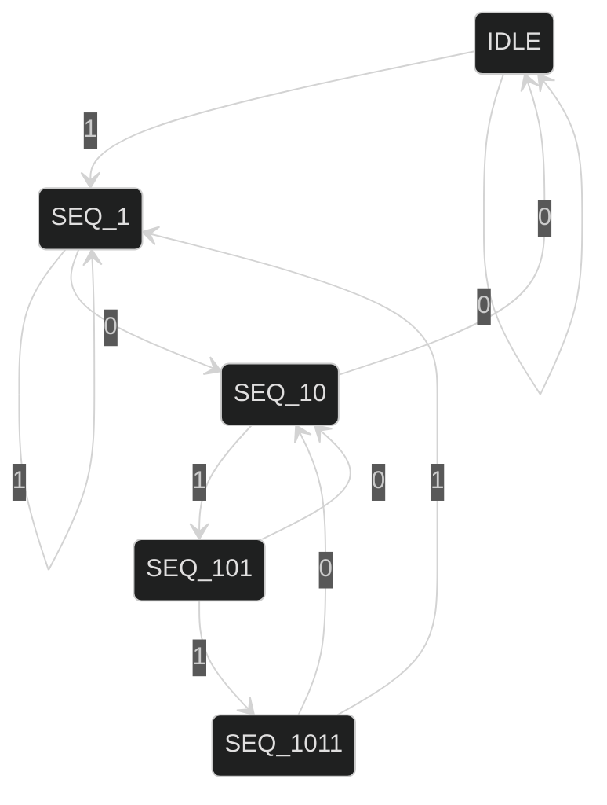

# This folder contains the design which will work for overlapping valid-sequences

<!-- 


 -->


## Python Model

- Whenever, we detect a valid `1011` pattern, we remove it from the input string, except the last `1`.
- This `1` will possibly become the beginning of the next `1011` pattern.

```python
def format_seq(input_seq):

    if ('1011' in input_seq):
        pos = input_seq.find('1011')
        input_seq = input_seq[(pos+3):]  #delete till the last but one. So that it will become part of the next sequence
            
    return input_seq    
```

## Verilog Modifications

```verilog
SEQ_1011: // this will detect overlapping sequences
begin
if(inp_bit == 1)
    next_state = SEQ_1; // if 1 goto SEQ_1 else goto SEQ_10
else
    next_state = SEQ_10;
end
```

## State Diagram



